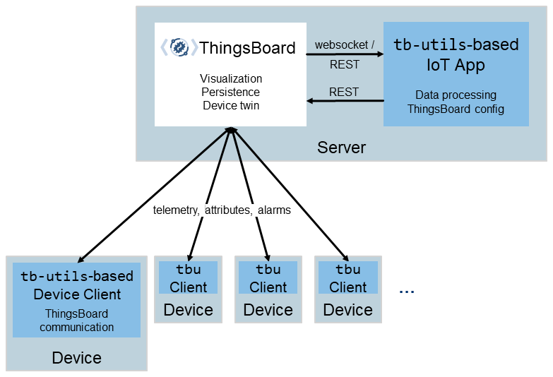

# Welcome to `tbutils`

   

> Develop IIoT Applications at ease with ThingBoard

An Java/Kotlin library of utilities for IIoT applications using the [ThingsBoard IoT platform](https://thingsboard.io).
It's built on top of the [ThingsBoard Java Client](https://thingsboard.io/docs/reference/rest-client/),
its [websocket](https://thingsboard.io/docs/user-guide/telemetry/#websocket-api)
and [mqtt](https://thingsboard.io/docs/reference/mqtt-api/) interface.

## What's in the box?

* [Improved Connectivity](#improved-connectivity) - Connect to ThingsBoard via REST and websockets to receive device
  updates and send data back to ThingsBoard
* [Device Autodiscovery](#device-autodiscovery) - discovery of active devices
* [Autoconfiguration of IoT Application](#thingsboard-autoconfiguration) - Streamline application development, but
  letting an application configure TB including dashboards, profiles, rule-chains and all other entities
* [User Management](#user-management) - Create tenants, users, and make sure a TB deployment is secure
* [Entity Management](#simplified-entity-management) - Allows managing TB entities programmatically at ease without
  using the web UI.

`tb-utils` is intentionally opionatied to enforce best-practices and robust IIoT applications.

## Getting Started

Nothing can beat a good example. So feel welcome to explore
the [vibration monitoring example application](examples/vibration-monitoring/README.md) to learn about how `tb-utils` can
help to streamline IIoT application development.

##  How to contribute?

Feel welcome to post ideas and suggestions to the project [tracker](https://github.com/systema/tbutils/issues).

We always welcome pull requests. :-)

## Support

Feel welcome to post questions and ideas in the project's [discussion forum](https://github.com/systema/tbutils/discussions)

## Sponsor

`tbutils` is devloped and sponsored by [SYSTEMA - Art of
Automation GmbH](https://www.systema.com/).
