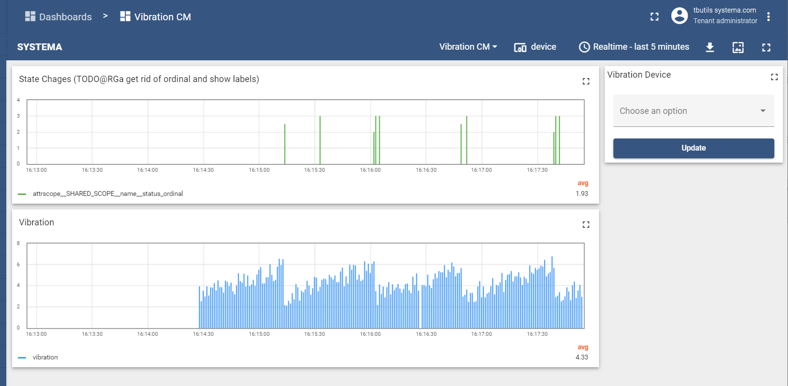
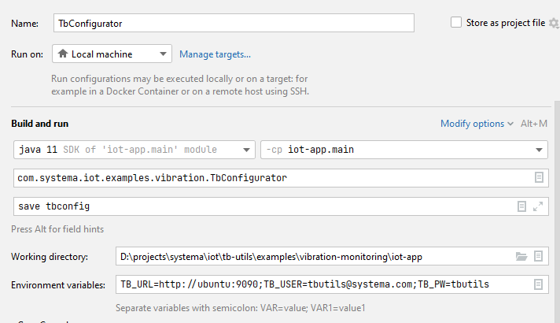

# IoT Application for Vibration Monitoring

IoT app to connect to ThingsBoard, subscribe to telemetry and attribute updates of the vibrating device, monitor the vibration, predict tool breakage due to vibration and trigger maintenance.


## Credentials

- ThingsBoard URL (`TB_URL`): http://localhost:9090
- application user:
  - user (`TB_USER`: `tbutils@systema.com`
  - password (`TB_PW`): `tbutils`
- sysadmin:
  - user: `tbutilsadmin@systema.com`
  - password: `tbutils`

## Run

### How to run from IDE?

1. Configure project from gradle
2. Set `TB_URL`, `TB_PW` and `TB_USER` (application user credentials) in the run configuration 

### How to run from terminal?

```bash
# publish to local m2-cache when using snapshot-dependency 
# cd ${TBUTILS_HOME} && ./gradlew publishToMavenLocal

cd examples/vibration-monitoring/iot-app 

source ../.env
./gradlew run  --args="-t ${TB_URL} -u ${TB_USER} -p ${TB_PW} --profile ${DEVICE_PROFILE}"
```

### How to run with compose?

The entire lifecycle is

```bash
cd examples/vibration-monitoring/

docker-compose build iot-app
docker-compose start iot-app

docker-compose logs -f iot-app
```


### How to run directly the container?

THis should just be needed when refining the image specs.

```bash
cd examples/vibration-monitoring/iot-app 

docker build -t iot-app .
docker run  --rm iot-app

## or debug container interactively
docker run  -it --rm --entrypoint /bin/bash iot-app

## How to save/load tb-configuration?

```bash
cd examples/vibration-monitoring/iot-app

# Define path to configs
export CONFIG_DIR=cfg/tbconfig
ls ${CONFIG_DIR} || exit 1

alias tbconfig='./gradlew -PmainClass=com.systema.iot.examples.vibration.TbConfigurator run'

# To Save configs
tbconfig  --args="save $CONFIG_DIR"

# To load configs (also done in processor app)
tbconfig  --args="load $CONFIG_DIR"
```

To save/load from IDE configure it as shown in the following screenshot


## References

* Offical MQTT example <https://github.com/thingsboard/samples/blob/master/facilities-monitoring/src/main/java/org/thingsboard/samples/facility/SampleMqttClient.java>
* Nice external API example with custom REST calls <https://www.javatips.net/api/thingsboard-master/tools/src/main/java/org/thingsboard/client/tools/RestClient.java>
* Used logging API <https://github.com/MicroUtils/kotlin-logging>
